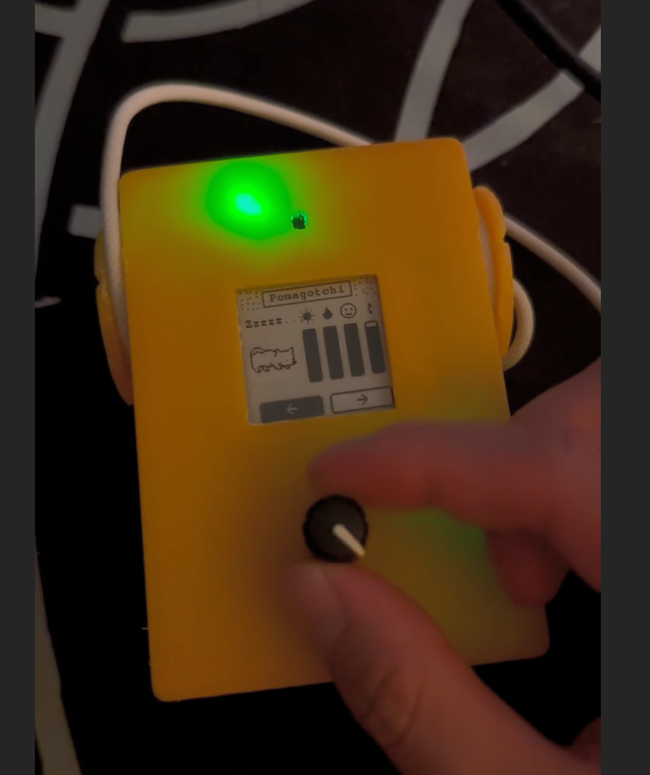
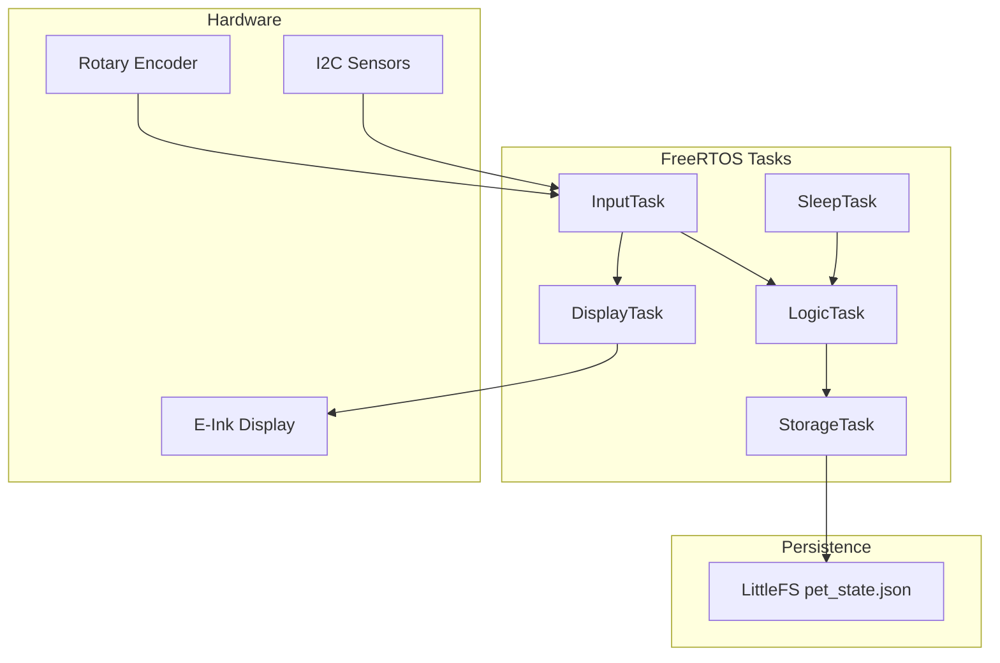

# Pomagotchi

A physical Tamagotchi-style virtual pet on ESP32 with a 1.54" e-ink display.



*Custom 3D-printed enclosure, 1.54" e-ink display, Seesaw rotary encoder, and status LED.*

## Overview

Pomagotchi is firmware for a handheld device that tracks the wellbeing of **Pommy**, a pixel-art cat. You log real-world activities — drinking water, getting sunlight, and petting — to keep Pommy's stats healthy. Earn stars for consistent care, then spend them on cosmetic hats in the in-game store.

Stats deplete over real time (~5 days from full to empty for sunlight and thirst). After 5 minutes of inactivity the device enters light sleep to save power; depletion continues while asleep, and sunbathing can still progress.

**Photos & demos:** [Pomagotchi vids on Imgur](https://imgur.com/a/LIptVTo) — GIFs and videos of UI navigation, activities, and gameplay.

## Features

- **5-screen ring UI** — Home → Water → Sun → Pet → Store, navigated via rotary encoder
- **Three stats** — Sunlight and thirst (0–100), affection (0–10)
- **Activity logging** — Water intake via encoder meter; sunlight via ambient light sensor; petting via proximity detection
- **Star economy** — Daily star when all stats stay above zero; bonus star for logging all three activities in a cycle
- **Cosmetic store** — Four purchasable/equippable hats (Tophat 10★, Cowboy 25★, Party 50★, Star 100★)
- **Light sleep** — 5-minute inactivity timeout; wakes on encoder interrupt
- **JSON persistence** — Save state on LittleFS with 30s periodic saves and event-driven writes
- **Sprite animations** — Walk, jump, sniff, and other sequences with hat overlay rendering
- **Serial debug console** — 25+ commands for headless navigation, stat injection, and observability
- **Debug mode** — Compresses day-scale timers to seconds for fast iteration

## Hardware

| Component | Details |
|-----------|---------|
| MCU | [Adafruit Feather ESP32 V2](https://www.adafruit.com/product/5400) |
| Enclosure | Custom yellow 3D-printed case |
| Display | 1.54" 200×200 e-ink (`GxEPD2_154_D67`), SPI pins 12–15 |
| Input | Adafruit Seesaw rotary encoder (I2C) |
| Sensors | VCNL4020 proximity/ambient light, LC709203F fuel gauge (STEMMA QT, SDA=23 / SCL=22) |
| Storage | 2MB LittleFS |

**E-ink pin map** (from `src/core/main.cpp`):

| Signal | GPIO |
|--------|------|
| RST | 13 |
| DC | 12 |
| CS | 14 |
| BUSY | 15 |
| MOSI / SCK | 35 / 36 (default SPI) |

Optional sensors degrade gracefully — if the light sensor or battery monitor is not detected at boot, the firmware continues without them.

## Architecture

Five FreeRTOS tasks coordinate input, display, game logic, persistence, and sleep management. Shared state is protected by `petStateMutex` and `displayMutex`; tasks communicate via queues.



| Task | Role |
|------|------|
| `InputTask` | Encoder polling, serial input, sensor reads |
| `DisplayTask` | Input dispatch and 100ms display refresh |
| `StorageTask` | Async LittleFS writes via queue |
| `LogicTask` | Stat depletion, sunbathing, petting, star grants |
| `SleepTask` | Inactivity detection and light sleep entry |

See [`src/core/tasks.cpp`](src/core/tasks.cpp) for task creation, queue sizes, and stack configuration.

## Project Structure

```
src/core/       main.cpp, FreeRTOS task orchestration
src/pet/        state, depletion, petting logic
src/activities/ water logging, sunbathing, store purchases
src/ui/         cursor, components, 5 screen renderers
src/hardware/   encoder, light sensor, battery monitor
src/storage/    LittleFS JSON persistence
src/system/     sleep manager
src/animation/  sprite sequences
src/assets/     embedded sprites + convert_sprites.py
data/           default pet_state.json (flashed to LittleFS)
scripts/        upload_all.sh
docs/images/    README media
```

## Getting Started

### Prerequisites

- [PlatformIO](https://platformio.org/install)
- Adafruit Feather ESP32 V2 with the hardware listed above
- USB cable

### Build and flash

```bash
pio run                    # Build
pio run -t upload          # Flash firmware
pio run -t uploadfs        # Flash LittleFS (required on first boot)
pio device monitor         # Serial console @ 115200 baud
```

Or flash firmware and filesystem in one step:

```bash
./scripts/upload_all.sh
```

**First boot:** You must run `uploadfs` at least once so `data/pet_state.json` is written to LittleFS. Without it, persistence will not initialize correctly.

## Developer Workflow

Pomagotchi is designed for fast iteration on constrained hardware.

### Serial debug console

Connect at 115200 baud and type commands followed by Enter. Run `help` for the full list.

| Command | Purpose |
|---------|---------|
| `help` | List all commands |
| `status` | Show current stats and page |
| `debug` | Toggle debug mode (accelerated timers) |
| `home` / `water` / `sun` / `pet` / `store` | Navigate to a screen |
| `left` / `right` / `enter` | Move cursor and select (headless UI control) |
| `set_thirst <0-100>` | Set thirst level |
| `set_sunlight <0-100>` | Set sunlight level |
| `set_pets <0-10>` | Set affection level |
| `set_stars <value>` | Set star count |
| `stars` | Show total stars |
| `proximity` | Show proximity sensor value and threshold |
| `set_proximity <value>` | Set proximity threshold |
| `sleep_enable` / `sleep_disable` | Toggle auto-sleep |
| `sleep_status` | Show sleep state and inactivity timer |
| `sleep_now` | Force light sleep |
| `stack_info` | FreeRTOS stack high-water marks and free heap |

### Debug mode

Toggle with the `debug` command. When active:

- Star checks run every **10 seconds** instead of 24 hours
- Activity multipliers increase **20×** (water, sunbathing)
- Petting increments **2×** per tick

This lets you exercise full game loops in minutes instead of days.

### Asset pipeline

Sprite bitmaps are embedded as C arrays in `src/assets/sprites.h`. To regenerate from source PNGs:

```bash
python src/assets/convert_sprites.py
```

Requires ImageMagick (`convert`) and Python PIL.

## Persistence

Game state is stored as JSON at `/pet_state.json` on LittleFS. The default seed file is [`data/pet_state.json`](data/pet_state.json):

```json
{
    "sunlight": 100,
    "thirst": 100,
    "petStatus": 10,
    "stars": 10,
    "lastStarCheckTime": 0,
    "waterLoggedFlag": 0,
    "sunlightLoggedFlag": 0,
    "petLoggedFlag": 0,
    "hats": {
        "topHat":      { "purchased": false, "wearing": false },
        "cowboyHat":   { "purchased": false, "wearing": false },
        "partyHat":    { "purchased": false, "wearing": false },
        "starHat":     { "purchased": false, "wearing": false }
    }
}
```

The storage task saves every 30 seconds and on stat-changing events (activity logged, hat purchased, etc.).

## Troubleshooting

| Problem | Fix |
|---------|-----|
| Blank stats or boot errors | Run `pio run -t uploadfs` to flash the default save file |
| Light sensor not found | Expected if VCNL4020 is disconnected; firmware continues |
| Battery monitor not found | Expected if LC709203F is disconnected; firmware continues |
| Serial not responding | Confirm 115200 baud and correct USB port |

## Tech Stack

C++ · Arduino framework · PlatformIO · FreeRTOS · GxEPD2 · ArduinoJson · LittleFS

## Resume & Application Notes

For reference when linking this repo on a resume or job application:

**Resume bullets:**

- Designed and built firmware for a physical Tamagotchi-style device on ESP32 (FreeRTOS, e-ink UI, I2C sensors), with a modular C++ architecture across 8 domain modules (`core`, `pet`, `ui`, `hardware`, `storage`, `activities`, `system`, `animation`)
- Built developer ergonomics into the firmware: a 25+ command serial debug console for headless navigation/testing, a `debug` mode that compresses day-scale timers to seconds, and a one-shot `upload_all.sh` flash pipeline (firmware + LittleFS filesystem)

**"Project you're proud of" note:**

> Pomagotchi is a physical Tamagotchi I built for someone close to me, but I approached it like a product: modular firmware, persistent state, and a serial CLI so I could iterate without constantly interacting with hardware. Debug mode turns multi-day game loops into second-scale tests. The project let me apply the same instincts I use at work — tightening feedback loops and making development feel fast — even on a constrained embedded target.
