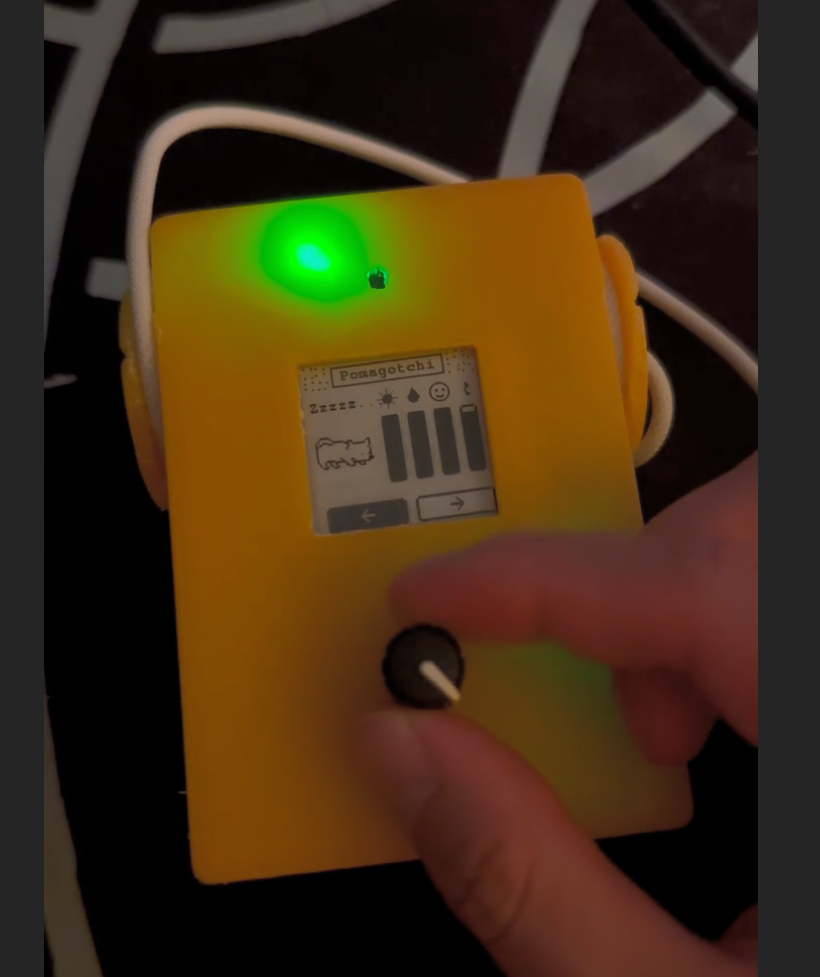
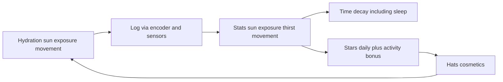

# Pomagotchi

A physical Tamagotchi-style wellness buddy — a handheld device I built for my significant other to make hydration, sun exposure, and movement habits tangible through **Pommy**, a pixel-art pomeranian.



*Custom 3D-printed enclosure, 1.54" e-ink display, Seesaw rotary encoder, and status LED.*

**Problem:** It is easy to forget small wellness habits, and phone apps feel abstract — they compete for attention and rarely create a lasting emotional cue.

**Solution:** A dedicated bedside object where real-world care maps to Pommy’s stats over **real days** — hydration, sun exposure, and movement — with a gentle loop of stars and cosmetic rewards.

**Proof:** [Pomagotchi demos on Imgur](https://imgur.com/a/LIptVTo) (UI, activities, gameplay). My significant other uses it **daily**; I have no usage analytics — impact is qualitative.

**Why this matters (PM lens):**

- **Habit loop** — stats decay → log activities → earn stars → spend on hats → repeat.
- **0→1 product** — I scoped, designed, and shipped the hardware enclosure and ESP32 firmware solo.
- **Constraint-driven design** — e-ink UI, light sleep, optional sensors, and flash persistence that survives sleep.

**Contents:** [Context](#context-and-primary-user) · [Problem](#problem) · [Why not an app](#why-not-an-app) · [Product spec](#product-specification) · [Walkthrough](#experience-walkthrough) · [Rewards](#reward-economy) · [Decisions](#key-product-decisions) · [Build journey](#build-journey) · [Impact](#impact) · [Scaled metrics](#if-this-were-scaled) · [Engineering map](#how-product-maps-to-engineering) · [Quick start](#quick-start) · [Engineering deep dive](docs/ENGINEERING.md)

## Context and primary user

I started Pomagotchi to give my **significant other** a “wellness buddy” — something delightful to check in on, not another checklist app. She is the **primary user**: the stats, timing, and rewards were tuned for her routines around hydration, sun exposure, and movement.

I owned product definition and implementation end to end: enclosure, electronics integration, firmware, and iteration from prototype to **daily driver**.

## Problem

The job to be done: **help build consistent wellness habits with something enjoyable to interact with.**

Phone-based wellness tools often fail the emotional and ambient test — they live behind a lock screen, notify at the wrong times, and do not create a persistent, shared character in the physical space. I wanted stakes that feel caring, not punitive, and feedback that fits on a nightstand or desk without demanding constant attention.

## Why not an app

**Insight:** For this user, habit change needed a **single-purpose, tactile artifact** — not another icon in a folder.

| Wellness apps | Pomagotchi |
|---------------|------------|
| Compete with every other notification | Present on the desk; no notification spam |
| Abstract progress bars | Pommy’s face and animations reflect care |
| Easy to ignore after week one | Physical object + slow stat decay creates gentle accountability |
| One-size-fits-all UX | Built for one primary user’s three habits |

I traded flexibility (any phone, any habit) for **focus** (three behaviors, one character, one device) and **craft** (e-ink, encoder, sensors).

## Product specification

### Goals

- Make hydration, sun exposure, and movement **visible and rewarding** through Pommy’s stats.
- Create **gentle urgency** with real-time decay (multi-day sun exposure/thirst, faster movement decay).
- Reinforce consistency: **daily star** when all stats stay above zero; **bonus star** when all three activities are logged.
- Sustain engagement via **stars → cosmetic hats** (progression through care, not monetization).

### Primary user

My significant other — daily use, qualitative feedback (see [Impact](#impact)).

### Functional requirements (shipped)

- **5-screen ring UI** — Home → Water → Sun → Pet → Store, via rotary encoder
- **Three stats** — Sun exposure and thirst (0–100), movement (0–10)
- **Activity logging** — Water meter; sun session; petting via proximity
- **Star economy** — Daily maintenance star + bonus for logging all three activities
- **Cosmetic store** — Four hats, purchasable and equippable
- **Light sleep** — Inactivity timeout; wake on encoder
- **JSON persistence** — LittleFS with periodic and event-driven saves
- **Sprite animations** — Walk, jump, sniff, etc., with hat overlays

### Non-goals

- Multi-user accounts or cloud sync
- Mobile companion app
- Medical or clinical claims
- Social sharing or leaderboards

### Design targets

| Stat / behavior | Target |
|-----------------|--------|
| Sun exposure | 0–100; −1 every **1.2 h** (~**5 days** from full to empty) |
| Thirst | 0–100; same decay as sun exposure |
| Movement | 0–10; −1 every **2 h** (~**20 h** from full to empty) |
| Daily star | Every **24 h** if sun exposure, thirst, and movement are **all > 0**; check interval resets only when a star is granted |
| Bonus star | Grant when water, sun, and pet **logging flags** are all set; flags reset after grant |
| Sleep | **5 min** inactivity → light sleep; depletion continues while asleep |
| Hats | Tophat **10★**, Cowboy **25★**, Party **50★**, Star **100★** |
| Sensors | VCNL4020 / fuel gauge optional — firmware continues if missing at boot |

## Experience walkthrough

Navigation is a fixed ring: **Home → Water → Sun → Pet → Store**, then back to Home.

| Screen | Real habit | Interaction |
|--------|------------|-------------|
| **Home** | Check Pommy’s overall state | Status at a glance; jump to any activity |
| **Water** | Hydration | Enter logging mode, fill a meter with the encoder, exit to apply thirst |
| **Sun** | Sun exposure | Fill via encoder; ambient light can advance progress while sunbathing when the sensor is present |
| **Pet** | Movement | Proximity detects a petting gesture; encoder adjusts movement only in debug mode |
| **Store** | Long-term motivation | Spend stars on hats; equip favorites on Pommy |

## Reward economy

**Daily star (maintenance):** Once per 24 hours, if sun exposure, thirst, and movement are all above zero, Pommy earns a star. If any stat is at zero, the device keeps checking on the same interval until stats recover — the timer does not reset until a star is actually awarded.

**Bonus star (completion):** Logging water, sun, and pet each sets a flag. When all three flags are set, Pommy earns an extra star and the flags reset.

**Store:** Stars unlock cosmetics only — Tophat (10★), Cowboy (25★), Party (50★), Star (100★) — to reward consistency without changing core difficulty.


```mermaid
flowchart LR
  realLife[Hydration sun exposure movement]
  log[Log via encoder and sensors]
  stats[Stats sun exposure thirst movement]
  decay[Time decay including sleep]
  stars[Stars daily plus activity bonus]
  store[Hats cosmetics]
  realLife --> log --> stats
  stats --> decay
  stats --> stars --> store
  store --> realLife
```

## Key product decisions

1. **Physical device vs wellness app** — Dedicated object for emotional attachment and ambient presence → custom enclosure + ESP32 firmware ([Engineering](docs/ENGINEERING.md)).
2. **Real-time decay over days** — Stakes that match life pace, not hourly punishment → depletion intervals in [`src/pet/depletion.h`](src/pet/depletion.h).
3. **Dual reward system** — Separate “keep Pommy healthy” from “complete all three habits today” → [`src/pet/pet_state.cpp`](src/pet/pet_state.cpp) (`checkAndGrantStars`, `checkAndRewardCompleteLogging`).
4. **Sensor-backed activities where possible** — Reduce friction vs pure self-report → sun progress from ambient light; petting from proximity ([`src/activities/sunbathing.cpp`](src/activities/sunbathing.cpp), [`src/pet/pet_pommy.cpp`](src/pet/pet_pommy.cpp)).
5. **Power vs continuity** — Battery life without pausing the care clock → light sleep after 5 minutes, depletion applied across sleep ([`src/system/sleep_manager.cpp`](src/system/sleep_manager.cpp)).

## Build journey

I went from a simple intent — a wellness buddy for my significant other — through a custom yellow enclosure and Feather ESP32 stack, then firmware for the five-screen loop, persistence, and sleep. Pomagotchi is now her daily driver; the serial debug console and compressed debug timers were how I validated multi-day game loops on the bench without waiting a week per iteration (details in [Engineering](docs/ENGINEERING.md)).

## Impact

She uses Pomagotchi every day. I did not instrument analytics; the outcome I care about is whether the device supports her habits and feels worth picking up.

> “I like Pomagotchi since the experience is different from my phone. The zero brightness e-ink screen means I can use it at night without impacting my sleep, and the different metrics reflect the habits I need help building (namely drinking enough water and getting enough sun in cloudy Seattle).”
> — Primary user (significant other)

> “I love how simple the experience of using Pomagotchi is. Having clear goals to ‘save up’ for keeps me coming back, but the simple and short nature of the different resource meters means I don't play with it too long.”
> — Primary user (significant other)

## If this were scaled

*Hypothetical metrics only — not measured on this single-user build.*

- **Daily engagement rate** — % of days the primary user logs at least one activity
- **Full-cycle completion** — % of days all three activities are logged (bonus-star behavior)
- **Care streak length** — consecutive days all stats stayed above zero (daily-star behavior)

## How product maps to engineering

| Product need | How it's built |
|--------------|----------------|
| Calm UI on e-ink | `DisplayTask`, ~100ms refresh, mutex around display |
| Correct habit timing offline | `LogicTask` + depletion intervals; sleep applies elapsed depletion |
| Motivation loop | `checkAndGrantStars`, logging flags, store in `store_purchasing` |
| Low power without losing stakes | `SleepTask` / 5 min inactivity; wake on encoder |
| Durable save on flash | `StorageTask`, queued writes, `pet_state.json` |

Full hardware, architecture, build, and debug guide → **[docs/ENGINEERING.md](docs/ENGINEERING.md)**

## Quick start

```bash
pio run && pio run -t upload && pio run -t uploadfs
```

Or `./scripts/upload_all.sh`. Prerequisites, serial console, and troubleshooting → [docs/ENGINEERING.md](docs/ENGINEERING.md).
